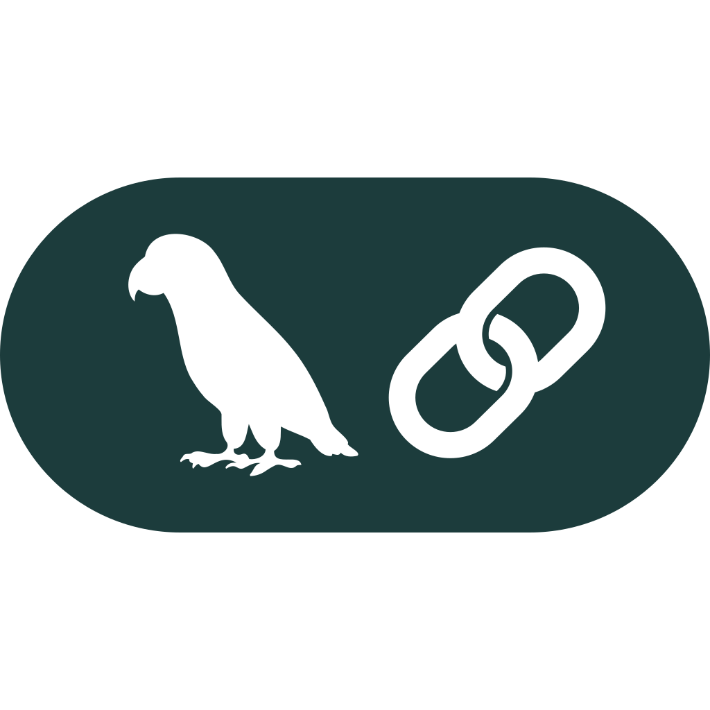

<div id="top">

<!-- HEADER STYLE: CLASSIC -->
<div align="center">




# CONVERSATIONAL BUSINESS ANALYTICS

<em>Empowering Innovation Through Seamless AI Integration</em>

<!-- BADGES -->


<em>Built with the tools and technologies:</em>


<br>


</div>
<br>

---

## Table of Contents

- [Overview](#overview)
- [Features](#features)
- [On Progress](#on-progress)
- [Getting Started](#getting-started)
  - [Prerequisites](#prerequisites)
  - [Installation](#installation)
  - [Usage](#usage)

## Overview

An open-source developer toolset for prototyping and managing **AI-powered, data-driven applications** with an emphasis on modularity and ease of deployment.

It combines a robust backend with an intuitive **Streamlit interface**, enabling seamless:

- project and manifest management,
- real-time data interaction,
- and AI workflow orchestration.

## Features

- 🧩 **Modular Architecture** – clear separation of database, core logic, and UI components.  
- 🌐 **Interactive Web UI** – built with Streamlit for real-time user engagement.  
- 🗃️ **Data Persistence** – ORM-based database schema for projects and manifests.  
- 🤖 **AI Workflow Support** – built with Langchain for orchestration.  
- 🔄 **Session & Manifest Management** – robust lifecycle handling for dynamic workflows.  
- 🐳 **Containerized Deployment** – Docker setup ensures reproducible environments.  

## On Progress

- 📊 **Business-Analytics** – aimed to support descriptive, diagnostic, predictive, and prescriptive analysis for business cases.  

---

## Getting Started

### Prerequisites

This project requires the following dependencies:

- **Programming Language:** Python
- **Package Manager:** Pipenv
- **Container Runtime:** Docker and Docker Compose

### Installation

Build cba-langchain-streamlit from the source and install dependencies:

1. **Clone the repository:**

    ```sh
    ❯ git clone https://github.com/reyharighy/cba-langchain-streamlit
    ```

2. **Navigate to the project directory:**

    ```sh
    ❯ cd cba-langchain-streamlit
    ```

3. **Install the dependencies:**

    ```sh
    ❯ pipenv install
    ```

### Usage

Run the project with:

**Using [docker](https://www.docker.com/):**

```sh
docker-compose up -d
```

Access the Streamlit app at: http://localhost:8501

---

<div align="left"><a href="#top">⬆ Return</a></div>

---
